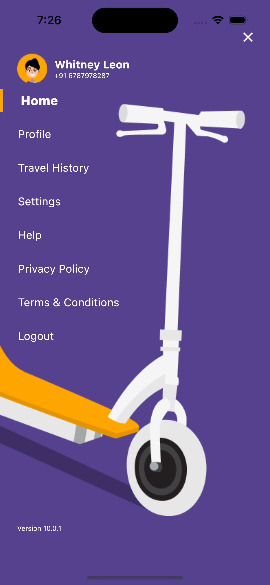

# Rockit Flutter

## Description

A new Flutter project that's for learning purpose. Since a best way to learn something new is to do it by yourself, I found this UI design in Figma and try to create this app from scratch (without any backend requests).

In this app, it includes some features:
- State Management:
    using flutter_bloc as the state management plugin.
- Animation: 
    using the AnimationSwitcher to fade in and out the text in Splash screen when clicking the "Next" button.
- Navigation: 
    using Navigator.pushReplacement to navigate to a new screen and disable the "go back" function.

## Getting Started

- Start your simulator
- Run and go ahead
